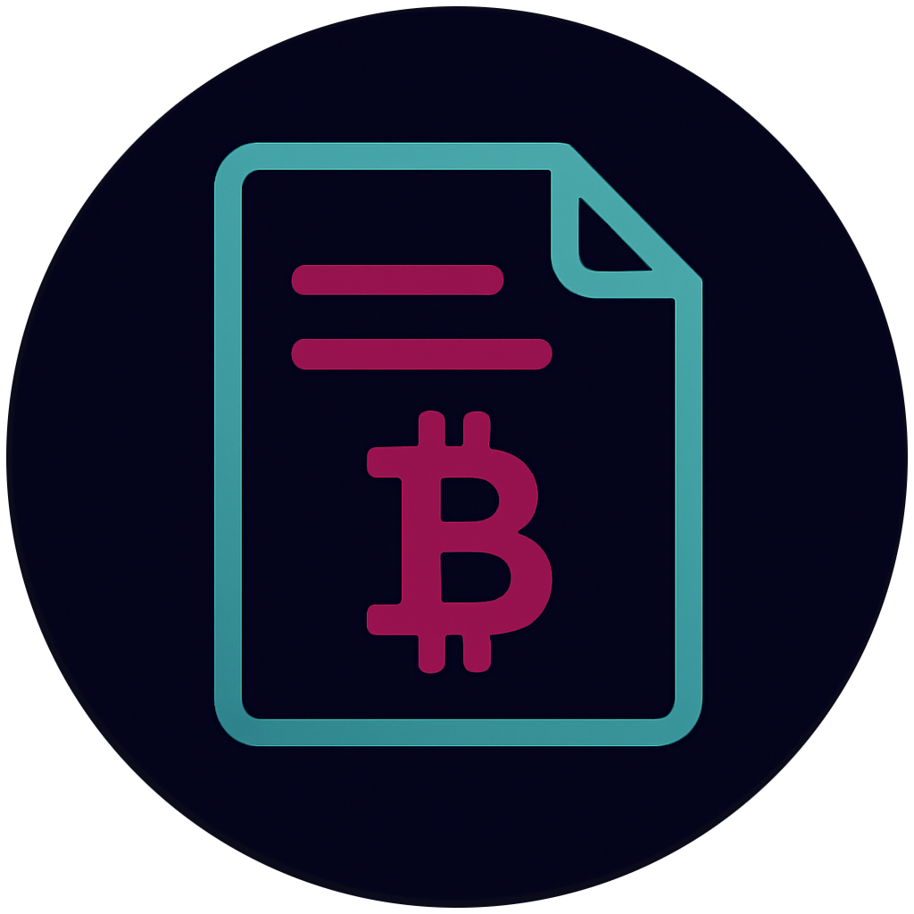
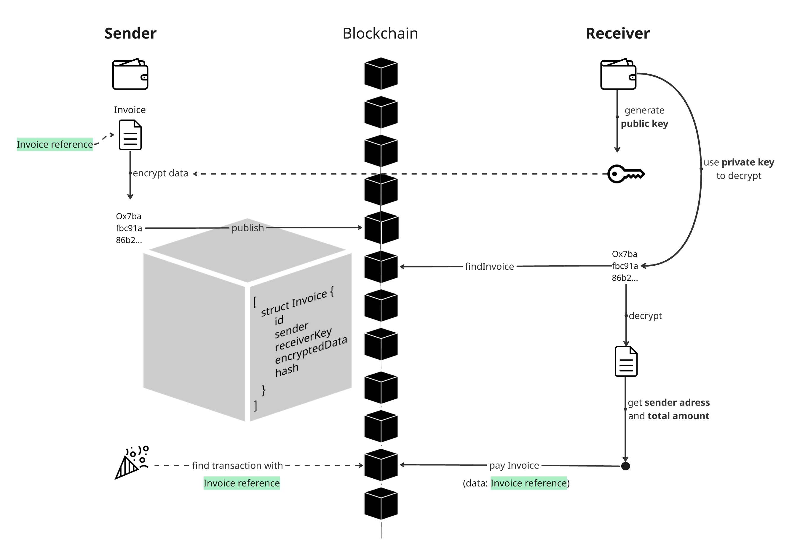

# Invoicing Portal – dApp

This project is a decentralized web application (dApp) for securely creating, encrypting, sending, and paying invoices on the Ethereum/Moonbeam blockchain.

**Features:**
- Invoices are encrypted client-side and stored on-chain in a smart contract.
- Recipients can decrypt their invoices using MetaMask.
- Invoices can be paid directly via MetaMask.
- No central storage – everything is handled via smart contract and wallet.

**Live on Monbase Alpha Testnet:**  
👉 [invoicingportal](https://invoicingportal.netlify.app)

**Note:**  
The app currently runs on an Moonbase (Testnet of Moonbeam). MetaMask is required

**Concept:**

**TODO**
* Baerer-Token stinstead of Recipient-Key
* Nonce 